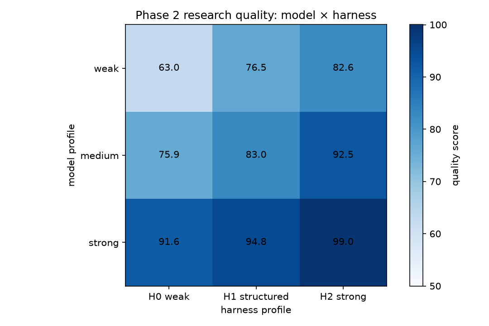
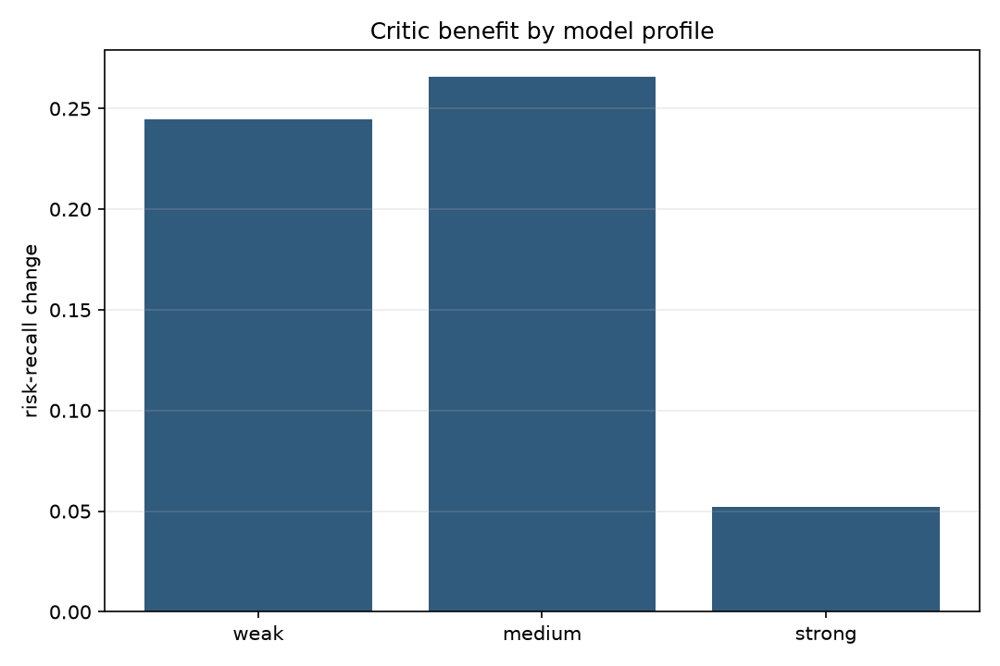
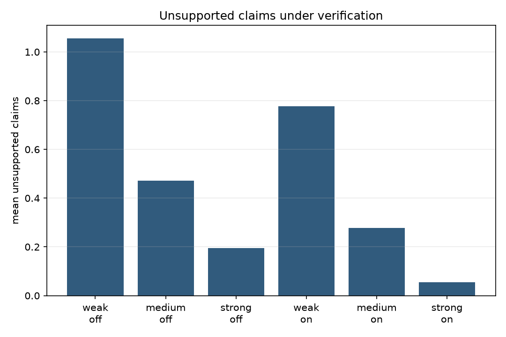
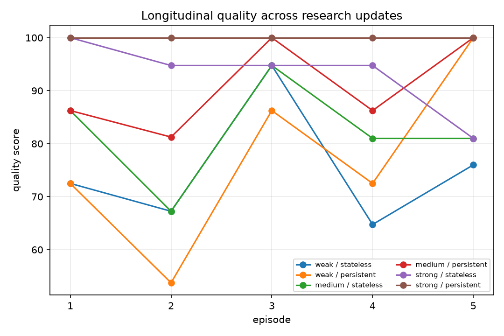
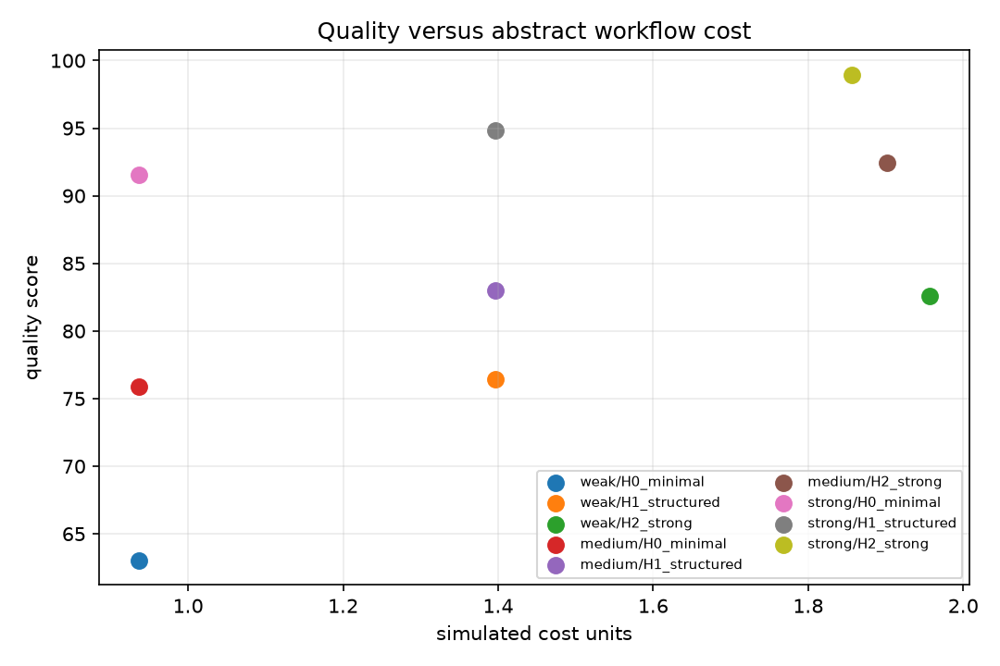

# Phase 2: model capability versus harness capability

## 1. Research motivation

Phase 1 showed that explicit workflow structure and adversarial critique improved a deterministic credit-research benchmark, while nominal role specialization, verification over already-supported claims, and intra-run persistence did not raise quality. Phase 2 asks whether those conclusions survive once the model can make realistic seeded errors.

> How much of institutional research performance comes from the underlying model, and how much comes from the structure imposed by the agent harness?

Phase 2 remains synthetic and offline. Its purpose is controlled attribution, not simulation of a particular commercial model or proof of live investment value.

## 2. Pre-registered hypotheses

| Hypothesis | Result in this benchmark |
|---|---|
| H1: strong harnesses help weak models more than strong models | Supported descriptively: H2−H0 is +19.58 points for weak, +16.59 for medium, and +7.40 for strong. |
| H2: strong models reduce but do not eliminate workflow benefit | Supported: the strong model rises from 91.55 under H0 to 98.95 under H2. |
| H3: critique helps weaker risk/contradiction capability more | Partially supported: risk recall gains are +24.48pp weak, +26.56pp medium, and +5.21pp strong. The weak/medium ordering is not monotonic. |
| H4: verification matters when support errors occur naturally | Supported mainly as a control effect: unsupported claims decline for every profile; quality gains are positive but modest. |
| H5: specialization helps only when information processing changes | Supported conditionally: context partitioning helps complex cases without changing call budget, but effects are small or heterogeneous. |
| H6: persistence helps longitudinal research | Partially supported: medium and strong models improve; the weak model anchors and performs worse despite less redundant work. |
| H7: harness gains carry workflow cost | Supported: mean abstract cost rises from 0.94 (H0) to 1.40 (H1) and roughly 1.86–1.96 (H2). |
| H8: some failures remain model-limited | Supported descriptively: weak/H2 reaches 82.60, below strong/H0 at 91.55, and retains lower support. |

These are observations from four seeds and synthetic episode families. No formal significance or real-model generalization is claimed.

## 3. Model profiles

[`StochasticSyntheticModel`](../src/institutional_investment_agents/stochastic_model.py) exposes weak, medium, and strong profiles as capability vectors rather than labels. The dimensions are reasoning accuracy, retrieval interpretation, tool selection, arithmetic without tools, contradiction detection, risk recall, citation fidelity, revision responsiveness, structured-output fidelity, and confidence calibration.

Weak values range from 0.52 to 0.72, medium from 0.73 to 0.88, and strong from 0.90 to 0.97. Each operation maps relevant capability shortfalls to seeded error probabilities. The simulator can produce omissions, unsupported claims, arithmetic and tool errors, retrieval/routing failures, premature synthesis, ignored contradictions, confidence errors, missed risks, malformed outputs, stale evidence use, failed revisions, and citation mismatches.

`DeterministicResearchModel` remains available for Phase 1. An optional [`OpenAICompatibleAdapter`](../src/institutional_investment_agents/adapters.py) implements the typed backend contract and records actual token metadata when returned, but no real-provider calls were made and no real-model findings are reported.

## 4. Harness profiles

- **H0 — Minimal (`H0_minimal`)** uses a mostly free-form process, no critic/verifier, limited state enforcement, and weak tool/evidence governance.
- **H1 — Structured (`H1_structured`)** adds an explicit plan, deterministic routing, evidence IDs, typed tool contracts, shared state, and audit events.
- **H2 — Strong (`H2_strong`)** adds context-partitioned specialists, critique, verification, contradiction handling, revision, approval, stale-evidence exclusion, and a complete trace.

The profiles are defined independently from the model in [`harness.py`](../src/institutional_investment_agents/harness.py).

## 5. Benchmark design

Nine parameterized families cover contradictory evidence, misleading cheapness, tool necessity, retrieval distractors, stale evidence, missing data, scenario sensitivity, false correlation, and multi-hop evidence. Each episode has versioned evidence, required risks, a directional target or explicit unknown, and flags for tools, contradictions, and missing fields.

The primary design crosses three model profiles × three harness profiles × nine families × four seeds: **324 factorial runs**. Each cell contains 36 observations. Focused critic (96), verification (216), specialization (96), and memory (24) studies bring the total to **756 runs**. On/off studies use paired base seeds; control-stage calls occur after the shared base analysis.

## 6. Factorial experiment

| Model | H0 quality | H1 quality | H2 quality | H2−H0 |
|---|---:|---:|---:|---:|
| Weak | 63.02 | 76.46 | 82.60 | +19.58 |
| Medium | 75.88 | 82.99 | 92.47 | +16.59 |
| Strong | 91.55 | 94.83 | 98.95 | +7.40 |

The balanced descriptive sum-of-squares decomposition attributes **26.2%** of quality variation to model profile, **12.5%** to harness profile, **1.9%** to their interaction, and **59.4%** to within-cell episode/seed residual. These shares describe this simulator; they are not universal causal proportions.

The weak model with H2 (82.60) exceeds the medium model with H0 (75.88) and nearly matches medium/H1 (82.99), showing partial compensation. It does not match strong/H0 (91.55), so the harness does not erase model limits.

## 7. Critic analysis

Critique raises risk recall from 61.98% to 86.46% for weak, 68.23% to 94.79% for medium, and 94.79% to 100% for strong. Quality gains are +9.01, +8.09, and +1.15 points respectively. Cost rises from 1.39 to 1.61 units for every profile.

Critique is compensatory when the base model omits risks, and closer to redundant for the strong profile. Because the critic experiment does not include a verifier, support errors are unchanged; critique improves risk and contradiction work rather than claim lineage.

## 8. Verification analysis

Verification plus revision lowers mean unsupported claims:

- weak: 1.06 → 0.78;
- medium: 0.47 → 0.28; and
- strong: 0.19 → 0.06.

Quality gains are +1.45, +0.76, and +0.59 points, while control-quality gains are +13.29, +11.66, and +11.31. Cost increases by about 0.27–0.34 units. This supports a distinction central to the project: verification improves auditability/control much more than it improves answer quality.

## 9. Specialist decomposition

The focused study holds operations, evidence, model profile, and mean model calls/cost at 7.5 calls and 1.41 units. “Specialists on” changes context partitioning on four complex families rather than role names alone.

Quality changes are +3.09 weak, +0.46 medium, and +1.15 strong. Risk recall changes are +14.06pp, +2.08pp, and +5.21pp. The weak profile benefits most, but the effect is not uniformly large. This refines rather than overturns Phase 1: nominal labels do nothing; altered attention allocation can help under complexity.

## 10. Persistent-state experiment

Five episodes represent initial research, an earnings update, a rating action, a rates shock, and new guidance. Persistent state retains prior thesis, evidence versions, assumptions, invalidation conditions, questions, and confidence history.

Persistence cuts redundant research operations from 15 to 6 for every profile and eliminates observed stale use. Update accuracy changes from 0.65 to 0.60 for weak, 0.75 to 0.85 for medium, and 0.95 to 1.00 for strong. The weak profile’s revision quality falls from 0.50 to 0.25 and anchoring reaches 0.25. Memory therefore creates both information benefit and anchoring risk.

## 11. Cost/quality trade-off

H0 averages 4.33 model calls and 0.94 abstract cost units; H1 averages 7.33 calls and 1.40 units; H2 averages roughly 9.8–10.3 calls and 1.86–1.96 units, depending on revision demand. Stronger harnesses improve quality, but H2 roughly doubles simulated cost versus H0. The project does not claim dominance without showing that trade-off.

## 12. Findings

The evidence supports the broader claim within the synthetic simulator:

> Agent capability is jointly determined by the model and the harness, and improvements attributed to “better agents” may actually arise from workflow structure, evidence handling, verification, or error correction.

It also limits the claim. Model profile explains more quality variation than harness profile, strong/H0 outperforms weak/H2, and most variation remains episode/seed residual. A harness is neither cosmetic nor a substitute for model capability.

## 13. Limitations

Profiles and error mappings are author-designed, not fitted to observed commercial-model error rates. Four seeds and nine synthetic families support descriptive comparison, not significance claims. Paired random streams reduce noise in focused experiments but do not reproduce natural-language correlation structures. The composite score remains normative. The real-model adapter was mock-tested only. Memory episodes are short and deterministic. Abstract token/cost units are not dollars.

## 14. Next research questions

The next phase should calibrate profiles against repeated real-model runs, introduce public SEC/issuer/FRED inputs with as-of controls, measure human expert review effort, expand longitudinal episodes, and test factorial combinations across actual models and harnesses under matched budgets. The [future-work agenda](future_work.md) keeps those steps separate from findings already established.
