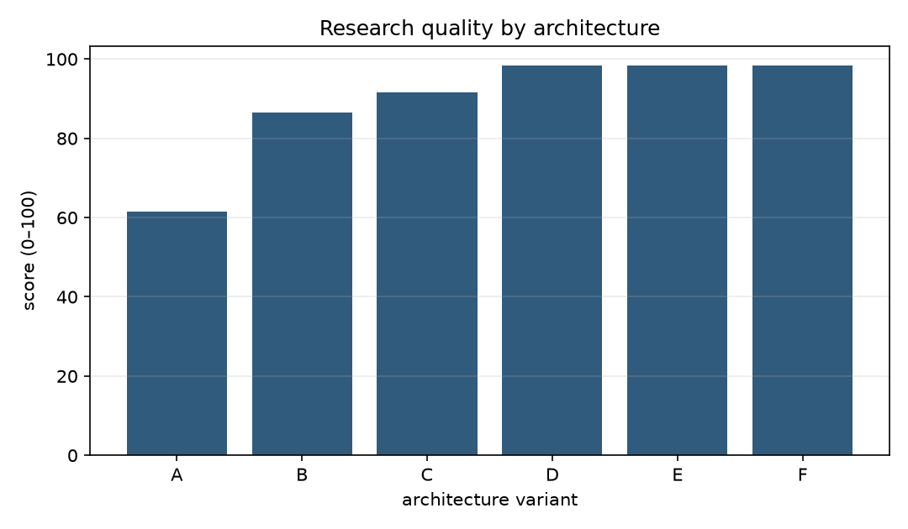
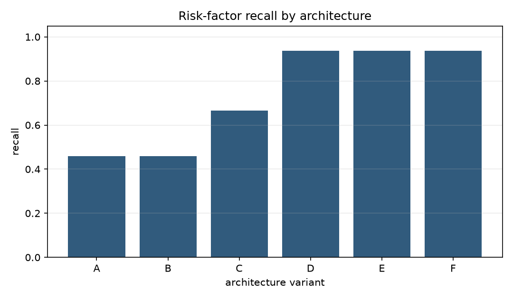

# Results and findings

## Phase 1: reading the results

The checked-in capstone report is [`results/capstone.md`](../results/capstone.md), backed by the run-level records in [`results/capstone.json`](../results/capstone.json). Values below are means across the relevant deterministic synthetic cases. They are benchmark observations, not estimates of live investment performance or production-model quality.

## Capstone summary

| Variant | Quality | Claim support | Risk recall | Unsupported claims | Tool calls | Steps |
|---|---:|---:|---:|---:|---:|---:|
| A. Observation/context-only baseline | 61.46 | 0.00% | 45.83% | 1.00 | 0.00 | 15.00 |
| B. Single research agent with tools | 86.46 | 100.00% | 45.83% | 0.00 | 3.00 | 24.00 |
| C. Structured specialist workflow | 91.67 | 100.00% | 66.67% | 0.00 | 3.00 | 27.00 |
| D. Specialists plus critic | 98.44 | 100.00% | 93.75% | 0.00 | 3.00 | 28.00 |
| E. Specialists, critic and verifier | 98.44 | 100.00% | 93.75% | 0.00 | 3.00 | 29.00 |
| F. Full workflow with persistent state | 98.44 | 100.00% | 93.75% | 0.00 | 3.00 | 29.00 |

## Workflow constraints produced a material gain

The controlled workflow ablation compares “Free-form specialist research” with “Explicit institutional workflow” while holding data, specialist availability, retrieval, and tools constant. Quality rises from **78.13 to 91.67**. Risk-factor recall rises from **45.83% to 66.67%**, evidence coverage rises from 0% to 75%, and the mean unsupported-claim count falls from one to zero.

This matters because the improvement does not require a stronger model. The workflow changes what tasks must be completed and how contributions enter state. It prevents a plausible-sounding unsupported judgment from substituting for issuer, market, and macro work. Because structured outputs and explicit tasks change together, the experiment supports the combined constraint package rather than identifying either mechanism independently.

## Specialist role labels alone did not help

The controlled single-versus-specialist experiment holds the explicit workflow, structured output, retrieval, tools, cases, seeds, critic, and verifier settings constant. Both “Single agent, structured workflow” and “Specialist agents, structured workflow” score **91.67**, with the same 66.67% risk recall, 100% claim support, three tool calls, and 27 steps.

This null result is useful. It rejects the assumption that a workflow improves merely because responsibilities are described as multiple agents. In this deterministic system, specialists share the same policy, evidence, tools, and state; changing attribution alone changes no information or error-correction behavior.

## The critic improved risk discovery

Adding the critic from capstone C to D raises mean risk recall from **66.67% to 93.75%** and the composite score from 91.67 to 98.44. It adds one audit step and does not increase tool calls.

The critic matters because it changes error correction: it searches for fragile assumptions and omitted explanations rather than restating the base analysis. The result is still bounded by synthetic risk labels and deterministic critic rules. It demonstrates that an adversarial stage can add measurable coverage in this benchmark, not that every critic prompt will improve real research.

## Verification improved control, not the score

Adding the verifier from D to E leaves quality at **98.44**, risk recall at **93.75%**, and unsupported claims at zero, while increasing steps from 28 to 29. Upstream structured claims were already fully supported, so there was no remaining support error for verification to remove.

This is not a failed control. Verification makes support status explicit, produces an auditable result, and can detect unsupported state in tests. The null score effect shows why preventive architecture and detective controls should be evaluated separately. A verifier should not receive quality credit for changing already-correct claims.

## Persistent state had no measurable intra-run benefit

Variants E and F have identical reported metrics. The implementation already uses explicit shared state within every run, and the benchmark contains no later research episode that could benefit from longitudinal memory. The result leaves the value of cross-episode persistence unresolved rather than showing that memory is generally useless.

## Overall interpretation

The evidence supports the possibility that:

> Architecture matters primarily when it changes information flow, constraints, or error correction—not merely when it changes role labels.

Tools and structured claims alter how information enters the research artifact. Explicit workflows alter required coverage. Critics alter error discovery. Verification alters observability and control. Nominal specialization, an extra verifier over already-supported claims, and a persistence flag without longitudinal tasks add sophistication without measurable quality gains here.

The figures for [claim support](../results/figures/claim_support_rate.png) and [tool calls](../results/figures/tool_calls.png) make the associated grounding and operational trade-offs visible. Null results are retained because the workbench is intended to falsify architectural claims, not justify complexity.

## Phase 2: model and harness effects

Phase 2 preserves the Phase 1 findings and adds stochastic model errors. Quality under H0/H1/H2 is 63.02/76.46/82.60 for weak, 75.88/82.99/92.47 for medium, and 91.55/94.83/98.95 for strong. The strong-harness benefit is therefore largest for the weak model, but strong/H0 still exceeds weak/H2.

Critique raises risk recall by 24.48pp weak, 26.56pp medium, and 5.21pp strong. Verification reduces unsupported claims for every profile and raises control quality by more than 11 points, while answer-quality gains remain below 1.5 points. Context-partitioned specialization produces modest, heterogeneous gains at the same model-call budget. Persistent state cuts redundant operations from 15 to 6, improves medium/strong update accuracy, and harms the weak profile through anchoring.

The checked-in [Phase 2 capstone](../results/phase2_capstone.md), [heatmap](../results/figures/phase2_model_harness_heatmap.png), and [full report](phase2_model_vs_harness.md) contain the complete results and caveats.
